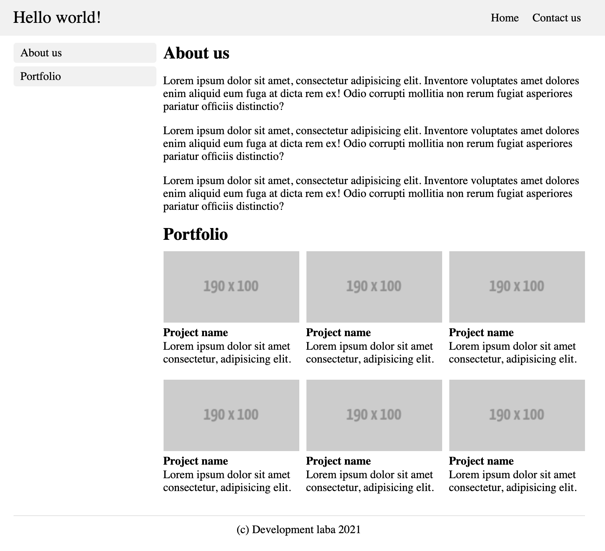

# HTML/CSS basics practice

Your code should work good only for new browsers (e.g. last version of Chrome) and only for desktop versions. We will not try to test your solution on small devices.

## 1. Float/inline-block experience

For the first task you need to implement a page using floats or inline-block elements.
So, you have the following template

You have to create smth like this.

### Additonal information

You can use your own values but here's what I used:

- gray color: `#f1f1f1`
- image example: `https://fakeimg.pl/190x100/`
- container width: `800px`
- sidebar width: `200px`
- space between the sidebar and the content: `10px`

### Definition of done

- **Semantic Elements**. The page structure should be semantically correct and includes most of HTML5 elements (header, nav, section, main and footer)
- **Floats or inline-blocks**. Your template should use floats or inline-blocks for positioning of elements

## 2. CV

Create a CV using pure HTML5 and CSS. It should be a page with [good but not complex design](https://www.google.by/search?safe=off&hl=en&tbm=isch&sxsrf=ALeKk03eHV0c0QVo5Q90l1NekwgRrkyGqw%3A1612763430463&source=hp&biw=1680&bih=842&ei=JtEgYPKNGo-TlwT2qayQCw&q=cv+page+design&oq=cv+page+design&gs_lcp=CgNpbWcQAzICCAAyBggAEAgQHjIGCAAQCBAeMgYIABAIEB4yBggAEAgQHjIGCAAQCBAeMgYIABAIEB4yBggAEAgQHjoECCMQJzoECAAQHlCNDFiyOmCAPmgEcAB4AIABmAGIAZIKkgEEMTcuMZgBAKABAaoBC2d3cy13aXotaW1n&sclient=img&ved=0ahUKEwjyuIL7y9nuAhWPyYUKHfYUC7IQ4dUDCAc&uact=5).

### Definition of done

- The HTML and CSS should pass W3C [HTML](https://validator.w3.org/#validate_by_uri) and [CSS](https://jigsaw.w3.org/css-validator/) validations
- The page structure should be semantically correct and includes most of HTML5 elements (header, nav, section, main and footer)
- On the page should be used different types of CSS includes
