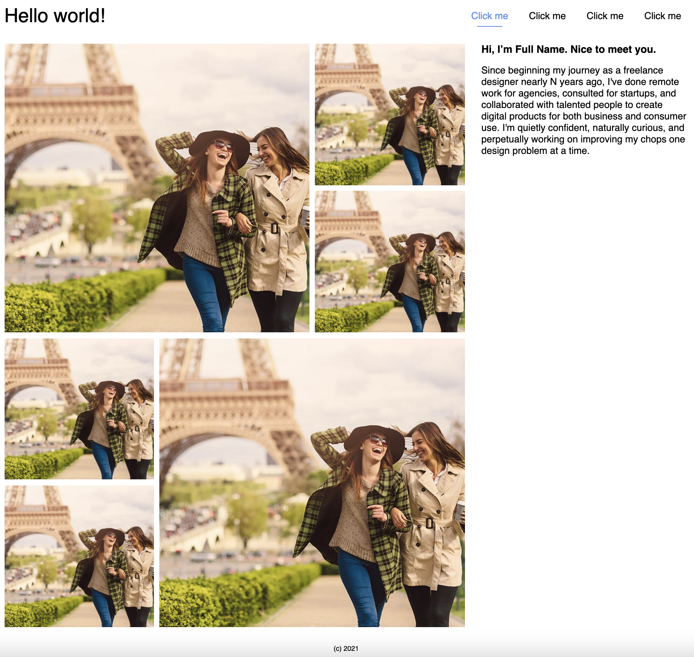
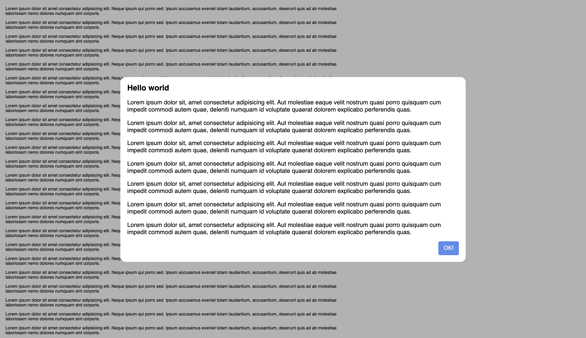
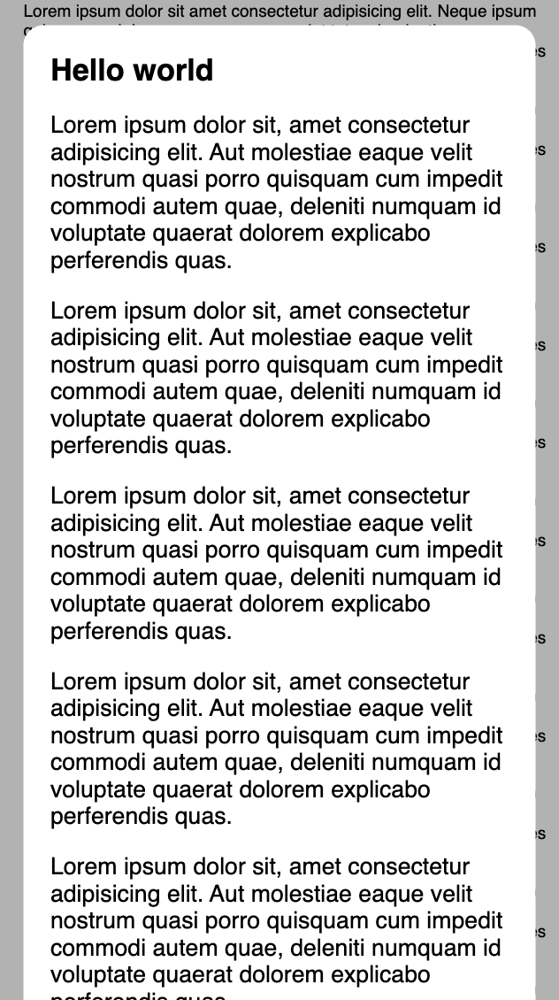
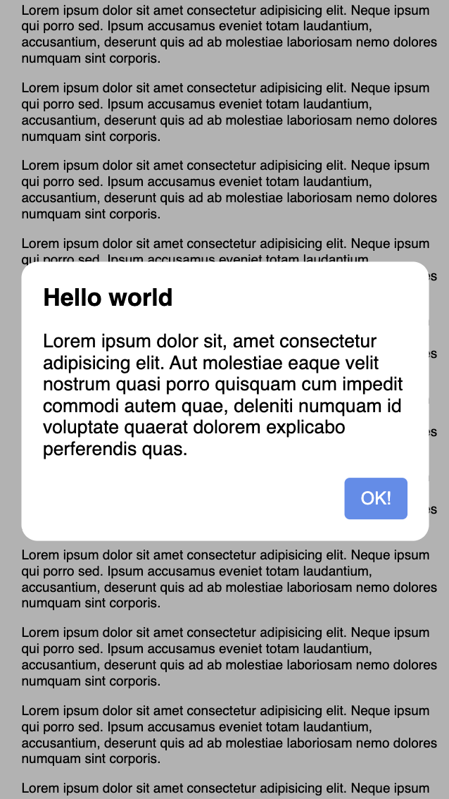

# HTML & CSS 2 practice

## Update CV

We need to adjust our CV using CSS advanced features and BEM

### Definition of done

* Should be used BEM approach for CSS classes
* Layout should be responsive and have a good look on mobile/tablet screens as well
* Mobile layout should be on screens width up to 600px (`x < 600`), tablet - up to 1024px (`600 <= x < 1024`)
* Should be added fixed button "scroll to top" on mobile view to the bottom of the page
* For main layout structure (root elements) should be used CSS grid, for other cases - flexbox or something else
* **Advanced**: main header should be sticky on mobile screens
* **Advanced**: main menu should be collapsed to the hamburger on mobile screens

## Flexbox/Grid template experience

You need to implement a page using flexbox or/and grid elements

### Definition of done

* Should be used BEM and semantics approaches
* Layout should be responsive and have a good look on mobile/tablet screens as well (feel free to choose your own breakpoints for different devices)

## Advanced: Modal window

This's an optional task. You need to implement modal window using whatever you want

### Definition of done

* The window should be centered horizontally and vertically
* Scroll bar appears if there are a lot of content. You can scroll down and up the whole content
* There are should be space between screen borders and the modal container

### Examples

#### Desktop view

#### Mobile preview with a lot of content

Make sure you can scroll your modal view

#### Mobile preview with little content

